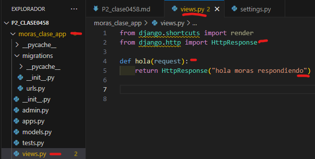

- crear aplicacion moras_clase_app
- comando --> python manage.py startapp moras_clase_app
- creamos el archivo urls.py en moras_clase_app
- 
- en setting.py de P2_clase0458
- 
- en urls.py de P2_clase0458
- 
- en urls.py en moras_clase_app
- 
- en views.py en moras_clase_app
- 
- en urls.py en moras_clase_app
- 